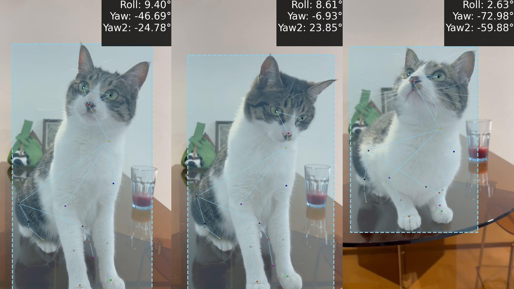

# AnimalPose: Detecting Any Animal Keypoints

## Project Overview

AnimalPose is a prompt-based keypoint detection framework that supports both textual and visual prompts to detect keypoints of animals and humans. It can extract keypoints such as nose, mouth, limbs, etc., from 2D images and calculate angles like roll and yaw based on the detected skeleton.

## 1.Environment Setup 

   1. Clone this repo
   ```sh
   git clone https://github.com/Owlsun321/AnimalPoseEstimation.git
   cd AnimalPoseEstimation
   ```

   2. Install dependencies 
   ```sh
   pip install -r requirements.txt
   ```

   3. Compiling CUDA operators
   ```sh
   cd algorithm/core/ops
   python setup.py build install
   ```

4.Run

```
python test.py
```

## 2.Input Video Processing

Assume you have a video of a pet moving left and right. You can process it to generate frames as follows:

1. **Create directories** :

   ```
   mkdir -p /AnimalPoseEstimation/algorithm/core/input/video-cat-corners
   ```

2. **Extract frames** :

   ```
   ffmpeg -i /AnimalPoseEstimation/algorithm/core/input/videos/2.mp4 -vf "select=not(mod(n\,6))" -vsync vfr /AnimalPoseEstimation/algorithm/core/input/video-cat-corners/frame_%03d.png
   ```

- `mod(n\,6)` means every 6th frame is extracted.

## 3.Keypoint Detection

3.1 Command-Line Detection

Run the following command to detect keypoints in a folder:

```
CUDA_VISIBLE_DEVICES=1 python algorithm/core/test_PoseEstimation.py \
-d "/AnimalPoseEstimation/algorithm/core/input/video-cat-updown" \
-o "/AnimalPoseEstimation/algorithm/core/output/video-cat-updown" \
-t "cat" \
-k "animal"
```

3.2 Batch Detection Using Configuration File

Alternatively, you can define parameters in a configuration file and run:

```
python algorithm/core/test2.py
```

- Parameters are defined in the configuration file.

------

### 4. Result Visualization

After detection, yaw and roll angles will be plotted on the images. Results will be saved in the `output` directory.



------

## Docker Environment Setup

If you wish to use Docker for quick deployment, you can pull the base image and run the container as follows:

# Pull the base image

1.Pull the base image 

```
docker pull docker-0.unsee.tech/pytorch/pytorch:2.2.2-cuda12.1-cudnn8-devel
```

or

```
docker pull pytorch/pytorch:2.2.2-cuda12.1-cudnn8-devel
```

2.Run the container

```
docker run --gpus all -it -v /path/to/local/project:/workspace docker-0.unsee.tech/pytorch/pytorch:2.2.2-cuda12.1-cudnn8-devel
```

3.Inside the container , follow the steps above to install dependencies and run the project (as described in the previous sections).

------

## License

This project is licensed under the MIT License.

------

## References

This project is based on [X-Pose ](https://github.com/IDEA-Research/X-Pose), which provides the foundational framework and support.
